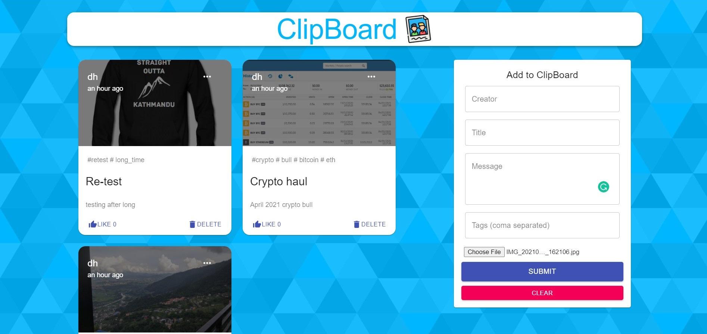

# Clipboard

Clipboard is a simple webApp that allows users to post interesting events that happened in their lives.
The App is built using React, Node.js, Express & MongoDB. 
A full stack webApp with CURD operation support.



## Tech
- ReactJS
- NodeJS
- Express
- MongoDB

## Pre-installation
npm as package manager needs to be installed before hand

## Setup and Installation
Install reuired modules
``` npm install```

In server directory: 
- Run server from heroku
``` npm run start ```
- Run server in localhost
``` npm start ```

In client directory
``` npm start ```

## Happy Haacking!!!

